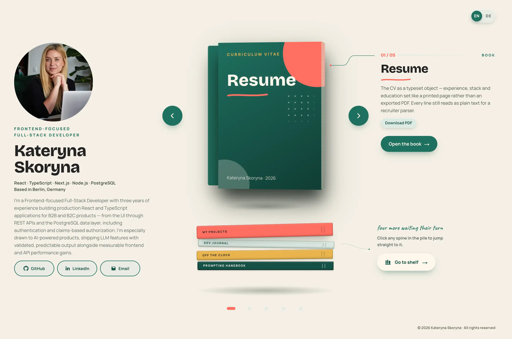

# Kateryna Skoryna — Frontend-Focused Full-Stack Developer

**[katerynaskoryna.com →](https://katerynaskoryna.com)**

React · TypeScript · Next.js · Node.js · PostgreSQL
[GitHub](https://github.com/KateSkoryna) · [LinkedIn](https://www.linkedin.com/in/kateskoryna/)



---

## What this is

My portfolio, built as a stack of physical objects that the visitor flips
through. Each object is a route:

- **`/resume`** — a book: the CV, typeset as pages, with a PDF download.
- **`/projects`** — a magazine: four projects with live GitHub data.
- **`/journal`** — a spiral notebook: the blog, written in MDX.
- **`/about`** — a newspaper: the things that never fit on a CV.
- **`/handbook`** — a field guide: *The Developer's Prompting Handbook*, how
  I make LLM output reliable enough to ship.

What I built: the design-token system, the component library (every cover,
closed book and piece of page chrome), the carousel and page-turn motion in
plain CSS, English and German localization, and a contact form that sends
email from a server action.

## Why it's built this way

A portfolio is also a chance to show real engineering judgement, not just
list it, so a few choices here are deliberate:

- **Server rendering only where it earns its keep.** `/projects` pulls
  live GitHub repo data with `revalidate: 3600` — real ISR with a reason,
  not "Next.js for the CV line."
- **Accessibility is a build gate, not a pass at the end.** Every route is
  scanned with `axe-core` in CI before it can merge; zero violations,
  checked automatically, not asserted.
- **One token file, no hardcoded values.** Every colour, radius, shadow and
  duration traces back to a single source — themeable, and provably
  consistent instead of "looks right in this one spot."
- **CI that actually gates.** Six independent checks (lint, format, types,
  tests, build, accessibility) run and are required on every PR before
  merge — each one has been proven to fail on a deliberately broken build,
  not just assumed to work.

## Stack

Next.js 16 (App Router) · TypeScript, `strict: true` · React 19 · CSS
Modules + a design-token system · `next-intl` (EN/DE) · MDX · Vitest +
axe-core · Vercel. No animation library, no canvas.

---

## Running it locally

```bash
npm install
npm run dev          # http://localhost:3000
```

```bash
npm run build         # production build
npm run lint            # eslint
npm run format:check    # prettier
npm run typecheck       # tsc --noEmit
npm run test              # vitest
npm run test:a11y         # axe-core against the built routes
```

CI (`.github/workflows/ci.yml`) runs all six as separate, independently
named checks on every PR.

## For anyone reading the code

- **`docs/DESIGN.md`** — the design contract: tokens, exact construction
  values, motion timings, the accessibility contract, and the reasoning
  behind each, including decisions reversed after getting them wrong once.
- **`docs/BUILD.md`** — the phase plan and per-phase definition of done.
- **`docs/PLAN.md`** — live status and the working protocol.
- **`docs/HANDBOOK.md`** — the handbook's content, in full.
- **`CLAUDE.md`** — repository conventions for AI-assisted sessions working
  in this repo.
